# 🚀 AI Commerce Intelligence Platform

<div align="center">


### 🤖 AI-Powered E-Commerce Recommendation & Analytics Platform

A modern business intelligence dashboard that combines product analytics, customer intelligence, recommendation systems, interactive visualizations, and executive reporting into a single platform.

</div>

---

# 📌 Project Overview

The AI Commerce Intelligence Platform is designed to simulate a real-world e-commerce analytics and recommendation system.

The platform helps businesses:

* Analyze products and customer behavior
* Generate AI-powered recommendations
* Monitor product performance
* Visualize business insights
* Track recommendation confidence
* Explore customer intelligence

---

# ✨ Key Features

## 📊 Executive Dashboard

* Business KPI Monitoring
* Revenue Overview
* AI Accuracy Tracking
* Customer Satisfaction Metrics
* Product Statistics
* User Statistics

---

## 📦 Product Intelligence

* Product Catalog
* Product Search
* Product Cards
* Product Ratings
* Product Categories
* Product Images

---

## 👥 Customer Intelligence

* Purchase History Analysis
* Search History Tracking
* Cart Activity Monitoring
* Customer Profile Overview

---

## 🤖 AI Recommendation Engine

* Personalized Recommendations
* Recommendation Scoring
* Explainable AI Recommendations
* Similar User Analysis
* Category Affinity Analysis
* Recommendation Confidence Metrics

---

## 📈 Recommendation Insights

* Best Recommendation Score
* Recommendation Leaderboard
* Product Popularity Ranking
* Confidence Analytics
* User Match Heatmap

---

## 📊 Analytics Dashboard

* Executive Analytics
* Product Category Distribution
* Category Breakdown Charts
* Rating Distribution
* Top Rated Products
* Interactive Plotly Visualizations

---

## ⚙️ System Monitoring

* Database Status
* Recommendation Engine Status
* Dashboard Status
* System Health Checks

---

# 🧠 Recommendation Algorithm

The recommendation engine combines multiple ranking signals:

### Category Affinity

Learns favorite categories from purchase history.

### Product Popularity

Tracks popular products across all users.

### Similar User Analysis

Identifies users with similar behavior.

### Product Ratings

Boosts highly rated products.

### Explainable AI

Provides reasons for every recommendation.

Example:

```text
Based on your purchase history
Matches your search interests
Popular among similar users
```

---

# 🛠️ Tech Stack

| Technology | Purpose               |
| ---------- | --------------------- |
| Python     | Core Development      |
| Streamlit  | Dashboard UI          |
| SQLite     | Database              |
| Plotly     | Interactive Analytics |
| Pandas     | Data Processing       |
| OOP        | System Architecture   |

---

# 📂 Project Structure

```bash
AI-Commerce-Intelligence-Platform/
│
├── dashboard/
│   └── app.py
│
├── src/
│   ├── product.py
│   ├── user.py
│   ├── recommender.py
│   ├── database_manager.py
│   ├── sample_users.py
│   └── product_images.py
│
├── database/
│   └── ecommerce.db
│
├── outputs/
│   └── recommendation_report.txt
│
├── main.py
├── requirements.txt
└── README.md
```

---

# 📸 Dashboard Screenshots

## 🚀 Executive Overview

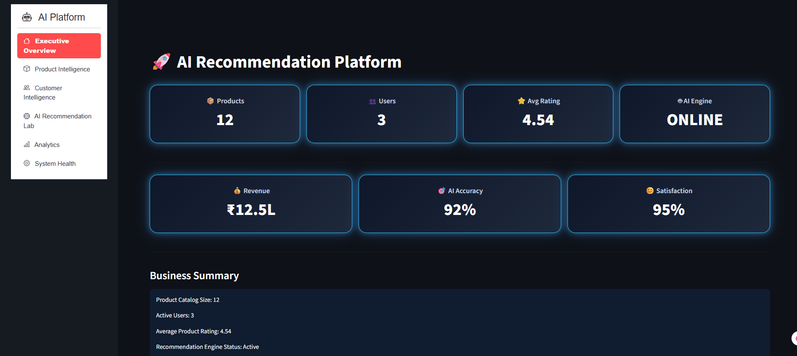

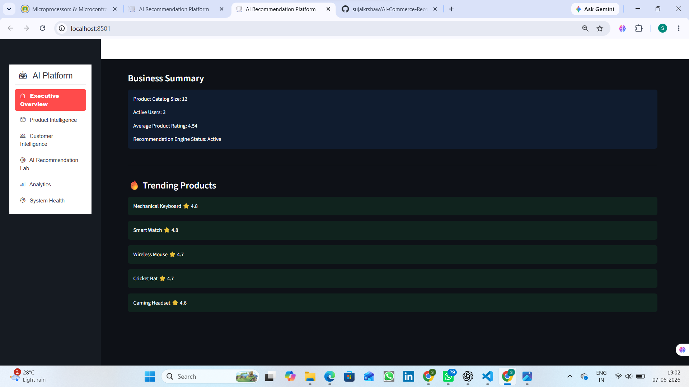

---

## 📦 Product Intelligence

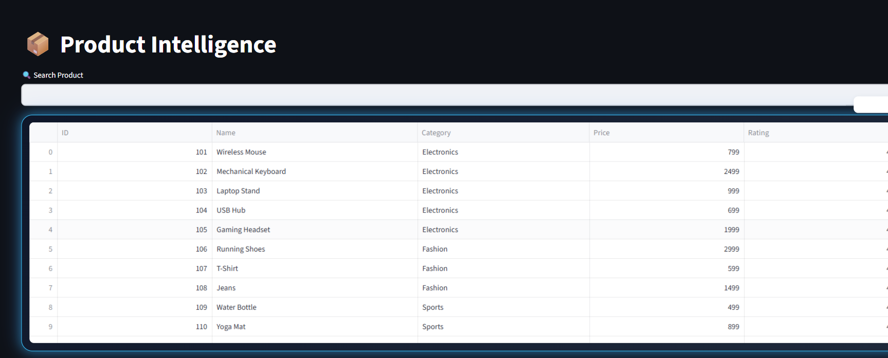

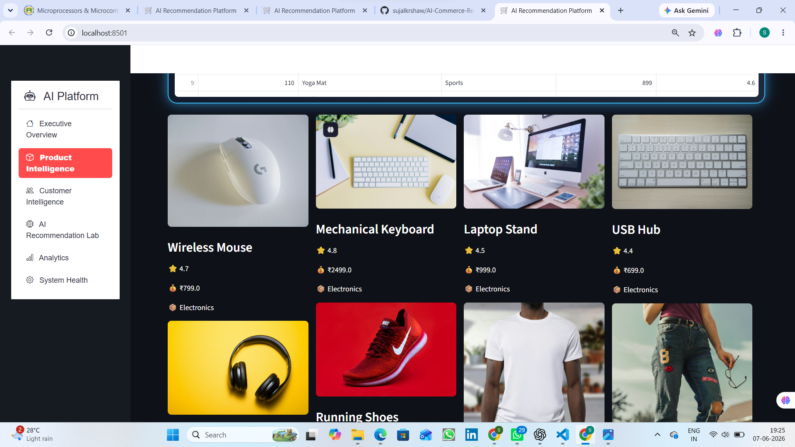

---

## 👥 Customer Intelligence

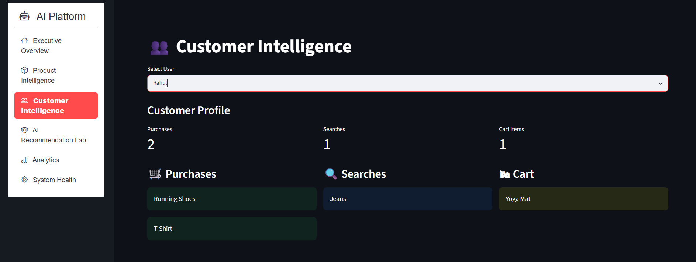

---

## 🤖 AI Recommendation Lab

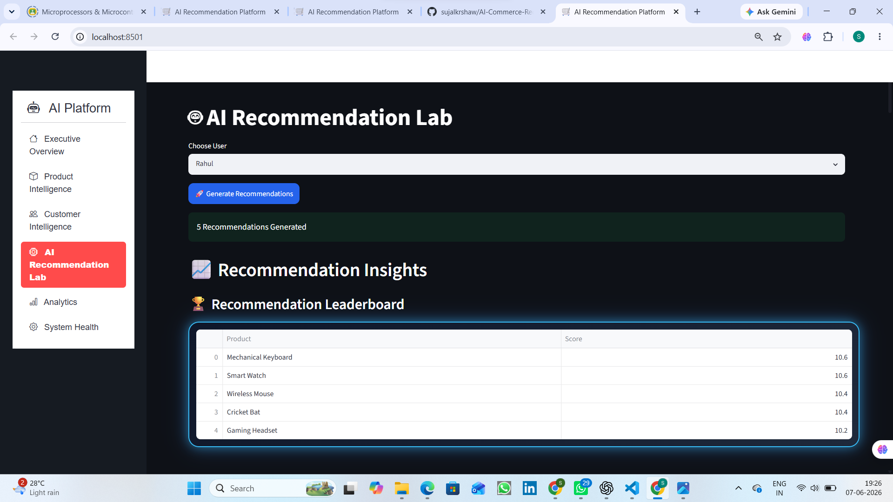

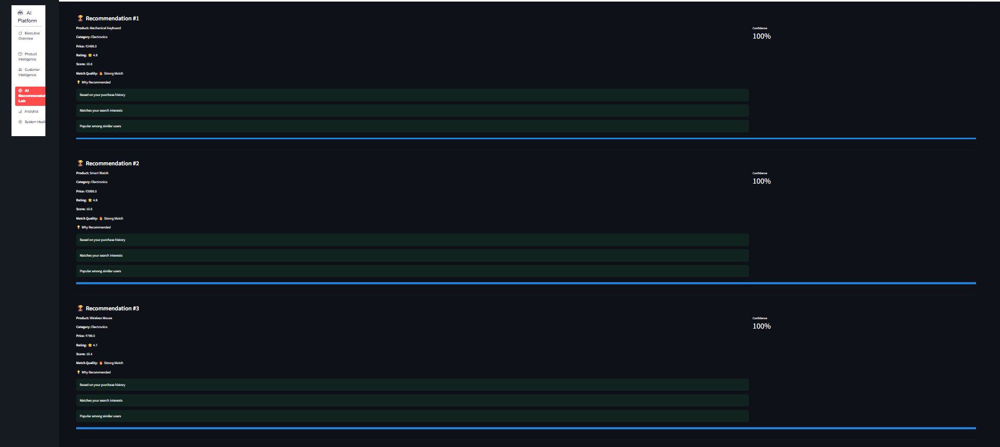

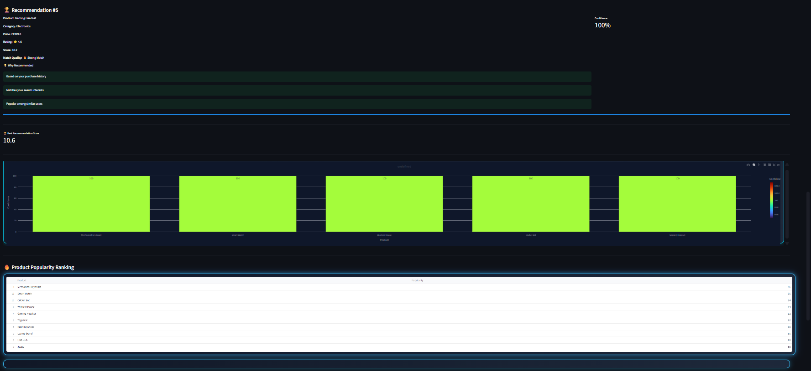

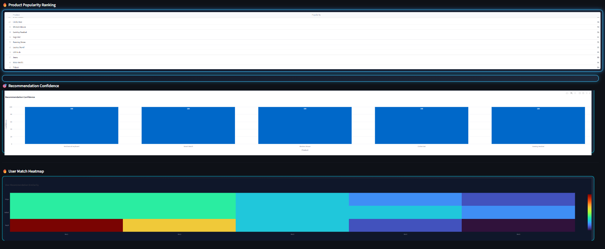

---

## 📊 Analytics Dashboard

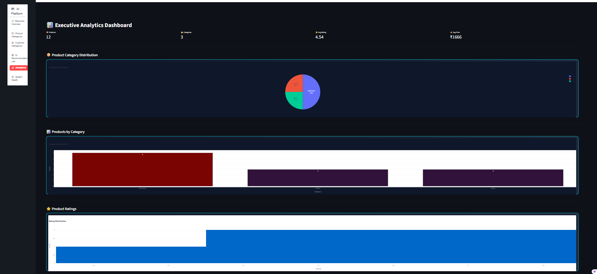

---

## ⚙️ System Health

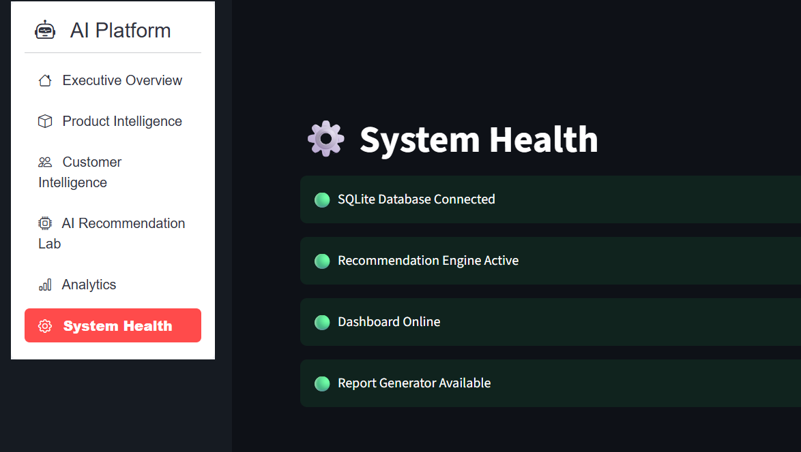

---

# 🚀 Installation

### Clone Repository

```bash
git clone https://github.com/YOUR_USERNAME/AI-Commerce-Intelligence-Platform.git
```

### Navigate

```bash
cd AI-Commerce-Intelligence-Platform
```

### Install Dependencies

```bash
pip install -r requirements.txt
```

### Run Dashboard

```bash
streamlit run dashboard/app.py
```

---

# 🎯 Learning Outcomes

This project demonstrates:

* Object-Oriented Programming
* Data Structures
* Recommendation Systems
* Data Analytics
* Business Intelligence Dashboards
* Database Management
* Interactive Visualizations
* Python Application Development

---

# 📈 Future Enhancements

* Authentication System
* User Roles (Admin/User)
* Real-Time Product Updates
* Cloud Deployment
* Machine Learning Recommendations
* Sales Forecasting
* Customer Segmentation
* Inventory Analytics

---

# 👨‍💻 Author

### Sujal Kumar Shaw

B.Tech Student | Python Developer | Data Analytics Enthusiast | AI & ML Learner

Passionate about building practical software solutions, recommendation systems, business intelligence dashboards, and AI-powered applications.

---

# ⭐ Support

If you found this project useful:

⭐ Star the Repository

🍴 Fork the Project

📢 Share with Others

---

<div align="center">

### 🚀 Built with Python, Streamlit, SQLite & Plotly

</div>
